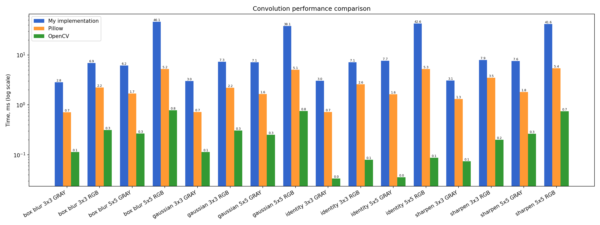

# Image Convolution

This repository stands for the implementation of image convolution on Python using arbitrary ways for padding and applying filters(kernels). It works as well with grayscale and RGB images.
Also results of my own processing are compared with the most popular python libraries for convolution, such as OpenCV and Pillow.

## Kernels:
  - **`identity`** - is used to remain the input image unchanged
  - **`box blur`** - is used to blur an image
  - **`sharpen`** - is used to make the image appear clearer and more defined
  - **`gaussian`** - is used to reduce image noise and detail by averaging the pixel values with a weighted Gaussian distribution

All of them are available both as 3x3 and 5x5 matrix sizes.

## Padding: 
- **`zero`** — zero padding
- **`edge`** — copying edge pixels
- **`reflect`** — mirror reflection
- **`wrap`** — cyclic repeatition


## How to use: 

### Setting up environment 
```bash
python -m venv venv
source venv/bin/activate  
pip install -e .
```

### Process the image with the available kernel
```python
python -m src.main images/input/cat.jpg images/output/blur.jpg \
 --kernel box_blur_3x3 --padding edge
```

### Or with the specified kernel
```bash
python -m src.main images/input/cat.jpg images/output/sharpen.jpg \
 --custom-kernel '0,-1,0;-1,5,-1;0,-1,0' --padding reflect
```

### Flag `--gray` converting the image as grayscale before convolution:
```bash
python -m src.main images/input/cat.jpg images/output/cat_gray.jpg \
    --kernel sharpen_3x3 --gray
```

## Tests
For this project I use`golden tests`.
Golden tests run convolution on a real image and compare the result with pre-saved expected images in tests/golden/.
### For running tests:
```bash
python -m pytest
```

## Structure of the project:
src/              
├── convolution.py ← implementation of convolution
├── padding.py     ← implementation of padding
├── kernels.py     ← kernels
├── main.py        ← CLI
└── benchmark.py   ← benchmark
tests/      
├── golden/        ← golden images
└── test_integration.py
images/
├── input/         ← input images
└── output/        ← processed images

## Benchmark comparison



